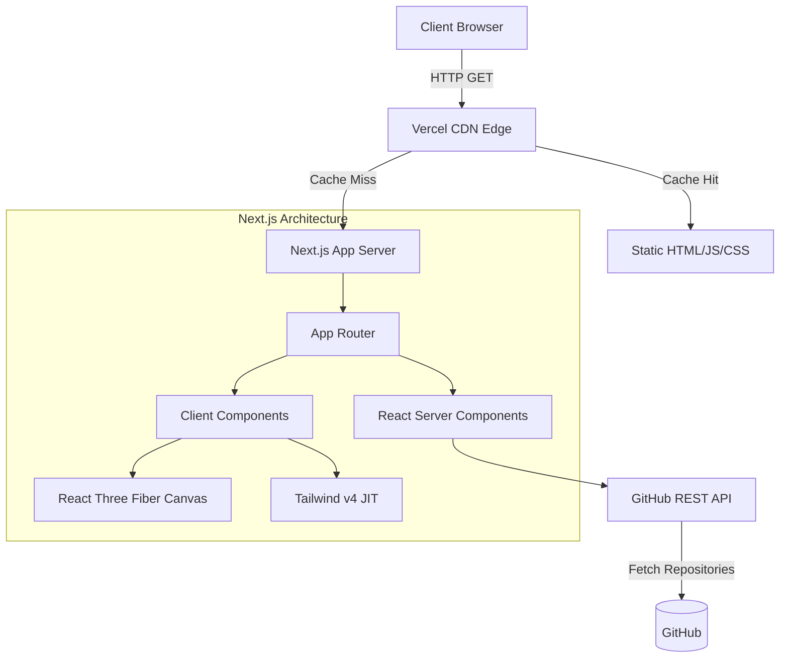

<h1 align="center">
  Kraken Fintech Portfolio
</h1>

<p align="center">
  A high-performance, design-driven software engineering portfolio built with Next.js App Router, Tailwind v4, and React Three Fiber.
</p>

<p align="center">
  <a href="https://github.com/saurabh30-bit/saurabh-portfolio/actions/workflows/ci.yml">
    
  </a>
  
  
  
  
</p>

---

## 🚀 Overview

This repository houses the source code for my personal developer portfolio. The architecture is heavily inspired by modern fintech design systems (codenamed "Kraken"), focusing on strict typography, high-contrast monochrome palettes with vibrant status indicators, and subtle 3D interactions.

## 🏗️ Architecture

The application is statically generated using Next.js to ensure lightning-fast Time to First Byte (TTFB) and perfect SEO scores.



## 🎨 Design System: "Kraken"

The UI is built upon a custom token system implemented directly in `globals.css` using the new `@theme` API in Tailwind CSS v4.

*   **Colors**: `Midnight Ink` (#101114), `Whisper Gray` (#f6f5f9), `Kraken Violet` (#7132f5)
*   **Typography**: `Space Grotesk` for brand headlines, `Inter` for precise product copy.
*   **Geometry**: Strict 8px border-radius for cards, ensuring a "regulated hardware" aesthetic.

## 💻 Running Locally

To run this project on your local machine:

1.  **Clone the repository:**
    ```bash
    git clone https://github.com/saurabh30-bit/saurabh-portfolio.git
    cd saurabh-portfolio
    ```

2.  **Install dependencies:**
    ```bash
    npm install
    ```

3.  **Start the development server:**
    ```bash
    npm run dev
    ```

4.  **Open the application:**
    Navigate to [http://localhost:3000](http://localhost:3000) in your browser.

## 🛠️ Continuous Integration (CI/CD)

This project uses **GitHub Actions** for CI. Every push to the `main` branch triggers a workflow that:
1.  Installs dependencies (`npm ci`)
2.  Runs code linting (`npm run lint`)
3.  Executes a production build (`npm run build`) to guarantee deployment safety.

Upon a successful build, Vercel automatically deploys the application to production.

## 📄 License

This project is open-source and available under the [MIT License](LICENSE).
